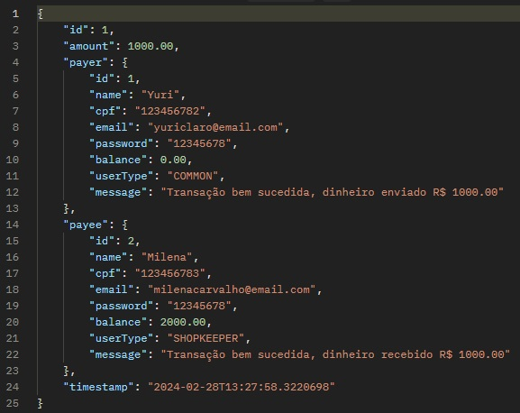
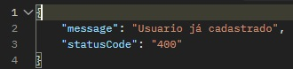
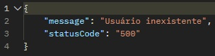
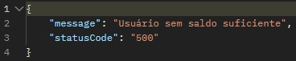
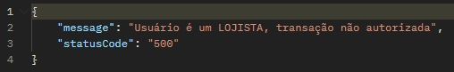

# Desafio Backend Picpay usando Spring Boot
Link do Desafio: https://github.com/PicPay/picpay-desafio-backend

# Tecnologias Utilizadas
- Spring Boot
  - Spring Web,
  - Spring Data JPA,
  - Lombok,
  - Spring Boot DevTools,
  - H2 Database

# Como funciona

O aplicativo PicPay Simplificado tem 2 tipos de usuários, os comuns e os lojistas, ambos têm carteira com dinheiro e realizam transferências entre eles. 

- Os usuários contem Nome Completo, CPF, email e senha. Sendo CPF e emails únicos no sistema
- Usuários podem enviar dinheiro (efetuar transferência) para lojistas e entre usuários.
- Lojistas só recebem transferências, não enviam dinheiro para ninguém.
- É feita duas validações no usuario antes da transferência:
    - a) Se o usuário é comun,
    - b) Se o usuário tem saldo suficiente.
- Antes de finalizar a transferência, um serviço autorizador externo é consultado para simular (https://run.mocky.io/v3/5794d450-d2e2-4412-8131-73d0293ac1cc)
- No final da transferência ambos os usuários atrelados a transferência, recebem uma notificação de um serviço externo (https://run.mocky.io/v3/54dc2cf1-3add-45b5-b5a9-6bf7e7f1f4a6) do resultado da transferência.

# Exemplos

O usuário do tipo COMUN chamado "Yuri", realiza uma transação de R$1000,00 para a usuária Milena do tipo LOJISTA que recebe R$1000,00. Somando um total de R$2000,00. No final da transação é enviada uma mensagem para ambos usuarios sobre o resultado da transferência.

Exceção quando já exite um usuário já cadastrado:

Exceção quando é feita uma pesquisa de um usuário que não existe:

Exceção quando é feita uma tentativa de transferência onde o usuario não possui saldo insuficiente:

Exceção quando é feita uma tentativa de transferência onde o usuário é do tipo LOJISTA:

